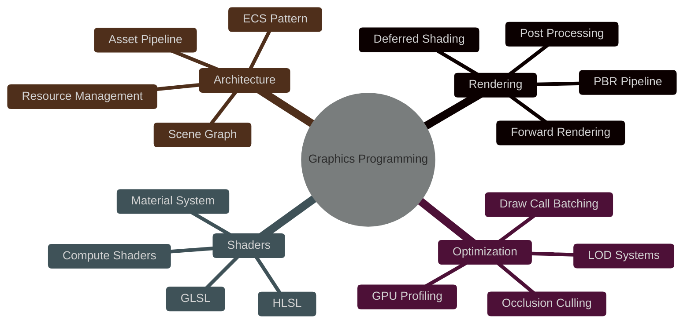

#  Graphics Programming Engineer

<div align="center">
  
  

  

</div>

##  About Me

```cpp
class GraphicsEngineer {
private:
    std::string name = "Juan José";
    std::string focus = "Graphics Programming & Game Engine Development";
    std::vector<std::string> passions = {
        "Real-time rendering", 
        "Engine architecture",
        "Low-level optimization"
    };

public:
    void code() {
        while (alive) {
            eat();
            sleep();
            renderFrame();
            optimizePipeline();
        }
    }
};
```

<div align="center">

### 🎯 Especializado en construcción de motores gráficos y experiencias 3D de alto rendimiento

</div>

---

##  Graphics Tech Stack

<div align="center">

### 🎮 Core Graphics APIs

<table>
  <tr>
    <td align="center" width="140">
      
      <br><strong>OpenGL</strong>
    </td>
    <td align="center" width="140">
      
      <br><strong>Vulkan</strong>
    </td>
    <td align="center" width="140">
      
      <br><strong>DirectX</strong>
    </td>
    <td align="center" width="140">
      
      <br><strong>SPIR-V</strong>
    </td>
  </tr>
</table>

### 🛠️ Languages & Tools


### 🎨 Game Engines

<table>
  <tr>
    <td align="center" width="140">
      
      <br><strong>Unity</strong>
    </td>
    <td align="center" width="140">
      
      <br><strong>Unreal Engine</strong>
    </td>
    <td align="center" width="140">
      
      <br><strong>Custom Engines</strong>
    </td>
  </tr>
</table>

### 💻 Backend & Additional Skills


</div>

---

##  Featured Projects

<div align="center">

### 🎮 Lunex Engine - Custom Game Engine
[](https://github.com/lluanllo/Lunex_engine)

> **Motor gráfico personalizado en C++ con OpenGL/Vulkan**
> 
> Sistema de renderizado 3D avanzado • ECS Architecture • Gestión de recursos • Editor visual

```
🔹 Rendering Pipeline optimizado con batching
🔹 Sistema de Entidades y Componentes
🔹 Post-processing effects (Bloom, SSAO, HDR)
🔹 PBR Materials & IBL
🔹 Scene serialization
```


---

### 🎯 OpenGL Renderer
[](https://github.com/Juanjocampus1/OpenGL_Renderer)

> **Sistema de renderizado moderno con shaders avanzados**

```
✨ Forward+ Rendering
✨ Deferred Shading
✨ Shadow Mapping (PCF, VSM)
✨ Normal Mapping & Parallax
```

---

### 🔥 Additional Graphics Projects

<table>
  <tr>
    <td width="50%">
      <h3 align="center">🎨 Shader Playground</h3>
      <div align="center">
        <p>Experimentación con efectos visuales avanzados y técnicas de renderizado</p>
        <code>Ray Marching • Volumetric Lighting • Procedural Generation</code>
      </div>
    </td>
    <td width="50%">
      <h3 align="center">⚡ Physics Engine</h3>
      <div align="center">
        <p>Motor de física integrado con detección de colisiones y constraints</p>
        <code>Rigid Body Dynamics • Collision Detection • Particle Systems</code>
      </div>
    </td>
  </tr>
</table>

</div>

---

##  GitHub Stats

<div align="center">
  
  
  

  
  
  

</div>

---

##  Technical Expertise

<div align="center">



</div>

### 🎯 Core Competencies

<details>
<summary><b>🎨 Rendering Techniques</b></summary>
<br>

- **Modern OpenGL 4.6+** - Bindless textures, DSA, compute shaders
- **Vulkan API** - Low-level GPU control, synchronization primitives
- **DirectX 11/12** - HLSL programming, command lists
- **PBR Materials** - Cook-Torrance BRDF, IBL, material authoring
- **Post-Processing** - Bloom, SSAO, SSR, Depth of Field, Motion Blur
- **Shadow Techniques** - CSM, PCF, VSM, ESM
- **Advanced Lighting** - Clustered forward+, deferred lighting, volumetrics

</details>

<details>
<summary><b>⚙️ Engine Architecture</b></summary>
<br>

- **ECS (Entity Component System)** - EnTT, custom implementations
- **Resource Management** - Asset streaming, memory pools
- **Scene Management** - Spatial partitioning, frustum culling
- **Serialization** - Scene saving/loading, asset pipelines
- **Editor Tools** - ImGui integration, gizmos, visual debugging

</details>

<details>
<summary><b>🚀 Performance Optimization</b></summary>
<br>

- **GPU Profiling** - RenderDoc, Nsight Graphics, PIX
- **Draw Call Optimization** - Instancing, batching, indirect drawing
- **Memory Management** - Cache-friendly data structures
- **Multi-threading** - Job systems, parallel scene updates
- **SIMD** - SSE/AVX for math operations

</details>

---

##  Currently Learning

<div align="center">

| Technology | Progress |
|------------|----------|
| **Ray Tracing** (DXR/VkRT) |  |
| **Mesh Shaders** |  |
| **Nanite-like LOD** |  |
| **GPU-Driven Rendering** |  |

</div>

---

##  Connect With Me

<div align="center">

[](https://jj.dev)
[](https://linkedin.com/in/tu-perfil)
[](mailto:tu-email@example.com)


</div>

---

<div align="center">

### 💭 Graphics Programming Quote

*"The best optimization is doing less work. The second best is doing it in parallel."*


**⭐️ From [lluanllo](https://github.com/lluanllo) - Building the Engines of Tomorrow**


</div>
